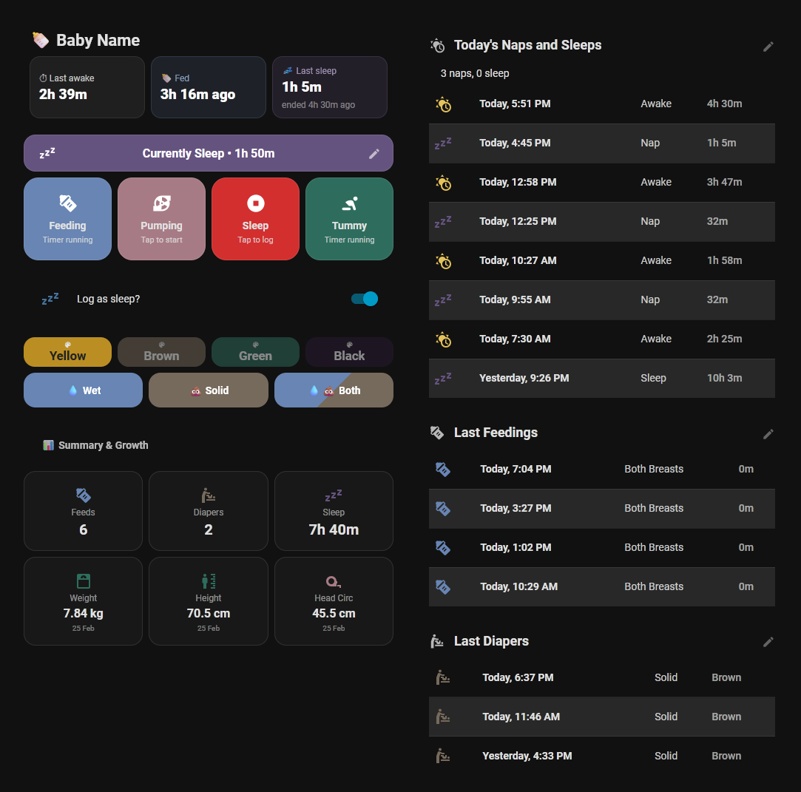

# **🍼 Baby Buddy Dashboard for Home Assistant**

A beautiful, interactive, and responsive custom dashboard for Home Assistant that tightly integrates with the [Baby Buddy](https://github.com/babybuddy/babybuddy) backend.



## **Features**

* **Instant Sync:** 2-way background syncing. Start a timer on your phone, and the HA dashboard updates instantly.  
* **Interactive Active Banners:** Banners show exactly what activity is running and for how long.  
* **Smart Edit Popups:** Tap an active banner to edit its start time, or tap the pencil icon to edit/delete past entries right from the dashboard.  
* **Orphan Timer Catching:** Warns you if an unclaimed timer is running in Baby Buddy and lets you assign it to an activity with one tap.  
* **Custom Sleep & Feed Tables:** Formatted historical logs right on the UI.

## **Prerequisites**

You must have the following set up and installed before generating your code:

**1\. The Baby Buddy Server:**

Baby Buddy must be already set up and running. You can host this in multiple ways:

* [Official Docker Container](https://github.com/babybuddy/babybuddy)  
* [Home Assistant OS Add-on](https://github.com/OttPeterR/addon-babybuddy)

**2\. Home Assistant Backend:**

* [Baby Buddy HACS Integration](https://github.com/jcgoette/baby_buddy) (Provides the base services and timer switches).

**3\. Home Assistant Frontend (Install via HACS):**

* [Browser Mod](https://github.com/thomasloven/hass-browser_mod) (For the edit/delete popups).  
* [button-card](https://github.com/custom-cards/button-card) (For the layout and UI logic).  
* [flex-table-card](https://github.com/custom-cards/flex-table-card) (For the historical logs).  
* [card-mod](https://github.com/thomasloven/lovelace-card-mod) (For borderless styling).

## **Step 1: Enable Packages in Home Assistant**

This dashboard relies on a Home Assistant "Package" to cleanly install all the required helpers, sensors, scripts, and automations into a single file.

*(From the official Home Assistant Documentation):*

Packages in Home Assistant provide a way to bundle configurations from multiple integrations. One way to organize packages is to create a folder named packages in your Home Assistant configuration directory.

To enable this, open your main configuration.yaml file and add the following entry. This will load all YAML files in the packages folder and its subfolders:
```
   homeassistant:
     packages: !include_dir_named packages
```
*Note: If you are moving configuration to packages, auth\_providers must stay within configuration.yaml. Also, ensure you do not have duplicate homeassistant: blocks.*

## **Step 2: Installation**

Because this setup requires custom helpers, REST commands, and specific entity names tailored to your child, you can choose to use the automated Web Generator or set it up manually.

**Important Note on Entity Names

This dashboard relies on the exact entity ID prefix created by the official Baby Buddy HACS integration (e.g., sensor.alex_smith, switch.timer_alex_smith).

* You must enter this exact prefix into the generator.

* Do not rename the base entity ID or timer switch ID inside Home Assistant after setup, or the dashboard buttons and stats will break!

### **Method A: Web Generator (Recommended)**

I have built a Web Generator that writes all the YAML code for you based on your setup to prevent indentation or formatting errors.

#### [**👉 Click here to open the YAML Generator**](https://zaifkhan.github.io/ha-babybuddy-dashboard/)

*(Note: Replace this link with your GitHub Pages URL once hosted)*

1. Open the generator and input your Baby Buddy server details and Child's name.  
2. **Configure Secrets:** Open your Home Assistant secrets.yaml file and add your API token exactly like this:  
```
   babybuddy_token: "Token YOUR ACTUAL_API_TOKEN"  
```
4. **Save the Package:** Copy the **Package YAML** from the generator and save it as a new file named babybuddy\_dashboard.yaml inside your config/packages/ folder.  
5. Restart Home Assistant to load the new configurations.  
6. **Create the Dashboard:** Create a new Manual Card in your Lovelace dashboard and paste the **Dashboard YAML** from the generator. Done\!

### **Method B: Manual Setup**

If you prefer to configure the YAML yourself, you can use the raw template files located in the docs/ folder of this repository.

1. **Configure Secrets:** Open your Home Assistant secrets.yaml file and add your API token:  
```
   babybuddy_token: "Token YOUR_ACTUAL_API_TOKEN"
```  
3. **Get the Templates:** Open the docs/ folder and locate package\_template.yaml and dashboard\_template.yaml.  
4. **Find and Replace:** Open both files in a text editor and do a strict "Find and Replace" for the following placeholders:  
   * \_\_URL\_\_ *(e.g., http://192.168.1.100:8000 \- do not include a trailing slash)*  
   * \_\_ID\_\_ *(e.g., 1\)*  
   * \_\_PREFIX\_\_ *(e.g., alex\_smith \- this must exactly match the entity prefix created by the official integration, e.g., sensor.**alex\_smith**\_last\_weight)*  
   * \_\_NAME\_\_ *(e.g., Alex \- Dashboard template only)*  
5. **Save the Package:** Save your edited package\_template.yaml into your config/packages/ folder as babybuddy\_dashboard.yaml.  
6. Restart Home Assistant to load the new configurations.  
7. **Create the Dashboard:** Create a new Manual Card in your Lovelace dashboard and paste your edited **Dashboard YAML**. Done\!

## **License & Credits**

This project is licensed under the MIT License. Feel free to modify and share\!
